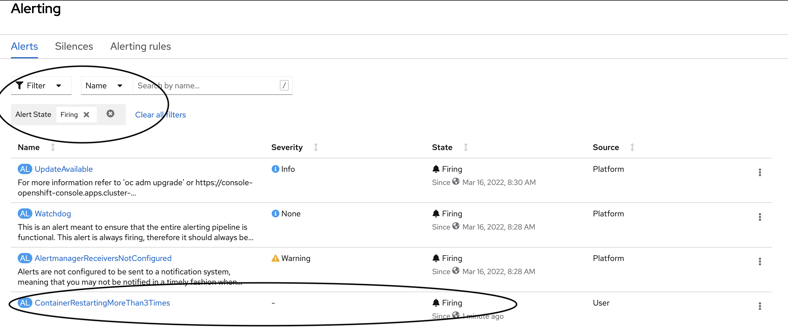

# Directions

## Create User Project and Application

Create project to test this alerts
> oc new-project ns1

Deploy sample app
> oc new-app openshift/nodejs:14-ubi8~https://github.com/sclorg/nodejs-ex.git -n ns1

## Enable User Metrics Gathering
Directions can be found in https://docs.openshift.com/container-platform/4.9/monitoring/enabling-monitoring-for-user-defined-projects.html

Edit or create ConfigMap to allow for gathering metrics on user workloads
> oc -n openshift-monitoring edit configmap cluster-monitoring-config

    apiVersion: v1
    kind: ConfigMap
    metadata:
      name: cluster-monitoring-config
      namespace: openshift-monitoring
    data:
      config.yaml: |
        enableUserWorkload: true

When this completes after a few minutes you should see a number of pods created in the **openshift-user-workload-monitoring** project.

    oc get pods -n openshift-user-workload-monitoring
    NAME                                  READY   STATUS    RESTARTS         AGE
    prometheus-operator-d985f58c8-r5ddr   2/2     Running   4                23h
    prometheus-user-workload-0            5/5     Running   10               23h
    prometheus-user-workload-1            5/5     Running   10               23h
    thanos-ruler-user-workload-0          3/3     Running   12 (3h38m ago)   23h
    thanos-ruler-user-workload-1          3/3     Running   12 (3h38m ago)   23h
 
## Clone Repo & Create Rules
> git clone https://github.com/brandoncox/alerting
>
> cd alerting
> 
> oc apply all -f .


## Trigger Alerts

1) Find Pods in the namespace we are monitoring


```
    oc get pods -n ns1
    NAME                        READY   STATUS      RESTARTS   AGE
    nodejs-ex-1-build           0/1     Completed   0          2m10s
    nodejs-ex-d689d44d7-2f59g   1/1     Running     0          50s
```

3) Trigger process in container to fail more than 3 times causing the Alert watching container restarts to fire
```
    oc exec nodejs-ex-d689d44d7-2f59g  -it /bin/bash
    bash-4.4$ pkill node
    bash-4.4$ command terminated with exit code 137
```

5) Verify that Alert is firing via UI
 ** remember to make sure filters are set correctly so that we are viewing user alerts that are firing **
 

